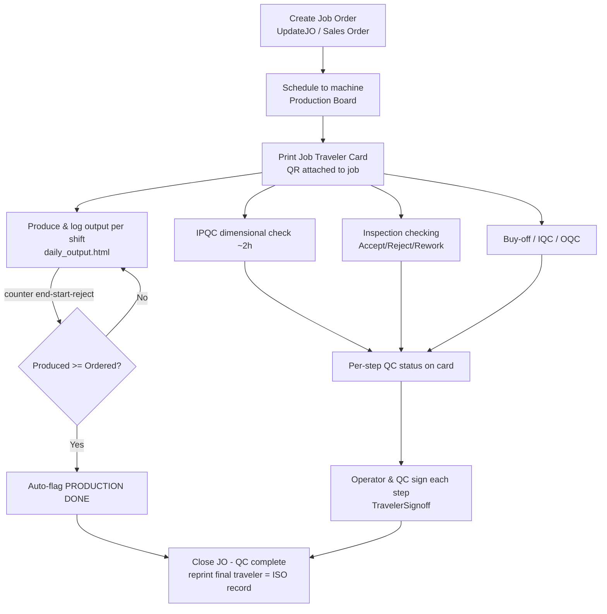

# Job Traveler Card — Process Workflow

The Job Traveler Card is a live, per–Job Order document that follows a job through its process
routing. It rolls up QC status (IPQC, Inspection Checking, Buy-Off), captures per-step operator/QC
sign-off, and tracks production output per machine by shift/day until the JO finishes producing.

Everything is keyed by the text **`JO_Number`**. The routing (list of process steps) comes from the
**part master flow** (`Parts.Process`).

---

## Roles

| Role | Responsibility |
|------|----------------|
| Sales / Planner | Creates the Job Order (or it is auto-created from a Sales Order). |
| Production Supervisor | Schedules the JO to a machine; prints the traveler card. |
| Machine Operator | Produces parts; logs output per shift; signs the operator column. |
| IPQC / QC Inspector | Runs dimensional & inspection checks; signs the QC column. |
| QA / Management | Reviews the card, closes the JO, files the printed traveler as the ISO record. |

---

## End-to-end steps

| # | Step | Who | Screen | What happens |
|---|------|-----|--------|--------------|
| 1 | **Create Job Order** | Sales / Planner | `screen_page/job_order/UpdateJO.html` (or auto from `production_planning/sales_order_entry.html`) | A `JO_Number` is created with **one row per process** taken from the part's `Parts.Process` master flow. |
| 2 | **Schedule to machine** | Production Supervisor | `FamaxMES/production_board.html` | Drag the JO onto a machine queue — sets `machine_id` + `sequence`. |
| 3 | **Print the traveler** | Production Supervisor | **Job Traveler Card** (from the home dashboard, or the *Traveler Card* button on the JO row) | Open the card, click **Print / Save PDF**. The card carries a QR of the `JO_Number`. Attach the printout to the job. |
| 4 | **Produce & log output per shift** | Machine Operator | `screen_page/production_planning/daily_output.html` | At end of each shift, record **Shift** (Day/Night), **Operator**, machine **counter start/end**, and **reject qty**. Net output = `counter_end − counter_start − reject`. The JO auto-flags **PRODUCTION DONE** once accumulated output ≥ ordered qty. |
| 5 | **In-process QC (IPQC)** | IPQC Inspector | `screen_page/ipqc/IPQC-page*.html` | Dimensional check (~every 2 hours): 3 readings per point vs LSL/USL. Out-of-spec readings turn the step **FAILED** on the card. |
| 6 | **Inspection checking** | QC Inspector | `screen_page/inspection/inspectionSchedule.html` → `inspectionCheckerForm.html` | Records Accept / Reject / Scrap / Rework per lot. Drives **PASSED / IN-PROGRESS / FAILED** on the card. |
| 7 | **Buy-off / IQC / OQC** | QC | Buy-off & QC pages | Buy-off OK/NG and lot-level IQC/OQC feed the step status and the card bookend rows. |
| 8 | **Sign off each step** | Operator + QC | **Job Traveler Card** | On the card, click **Sign** in the Operator and QC columns for each completed process. Signatures + timestamps are stored in `TravelerSignoff`. |
| 9 | **Close the JO** | QA / Management | `screen_page/job_order/UpdateJO.html` | When QC is complete, mark the JO **Completed** (QC completion — separate from *production done*). Re-print the final traveler as the ISO record. |

---

## How the card decides each step's QC status

Evaluated per process step, first match wins:

1. **FAILED** — a Buy-Off `NG`, **or** any IPQC reading outside `[LSL_OK, USL_NG]`, **or** reject qty > 0 with no accept.
2. **PASSED** — an Inspection record with Accept > 0 and Reject = 0, **or** a Buy-Off `OK`, **or** a completed Inspection schedule — and no failing signal.
3. **IN-PROGRESS** — some IPQC/Inspection activity exists but acceptance is not complete.
4. **PENDING** — no records yet.

## Production tracking (Section B)

- Output is captured **per shift** using machine counters. Two shifts:
  - **Day** 08:00–18:00 (overtime counted to 19:00)
  - **Night** 19:00–05:00 (crosses midnight → logged under the date the shift **started**)
- Per process step, the card shows **Produced / Reject / Remaining** and a progress bar, expandable
  to a Date / Shift / Machine / Counter breakdown.
- When produced ≥ ordered quantity, the JO's `production_completed_at` is set and the card shows a
  **PRODUCTION DONE** badge. This is independent of QC completion.

---

## Flow diagram

---

## Data tables touched

| Table | Role |
|-------|------|
| `JobOrder` | Routing rows (one per process) + `produced_qty`, `production_completed_at` (new). |
| `Parts` | `Process` master flow = the routing spine. |
| `Daily_Output` | Per-shift output; extended with `shift`, `operator` (new). |
| `Data_IPQC` | Dimensional readings vs LSL/USL. |
| `InspectionRecord` / `InspectionSchedule` | Lot inspection results & schedule. |
| `Data_BUYOFF` / `data_buyoff_logs` | Buy-off OK/NG. |
| `TravelerSignoff` | Per-step operator/QC signatures (new). |
